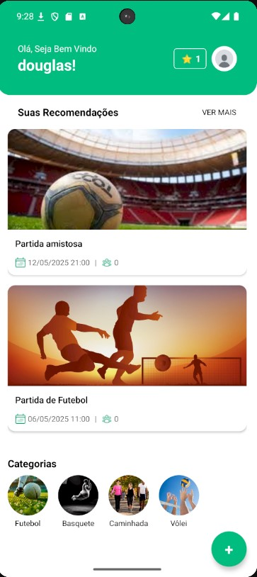

# BootCamp Connect

## Visão Geral

BootCamp Connect é uma aplicação móvel desenvolvida em React Native que permite aos usuários criar, participar e gerenciar atividades esportivas. O aplicativo oferece funcionalidades como autenticação, criação e edição de atividades, visualização de perfil de usuário e seleção de preferências.



## Índice

- [Instalação](#instalação)
- [Configuração do Ambiente](#configuração-do-ambiente)
- [Executando o Aplicativo](#executando-o-aplicativo)
- [Estrutura do Projeto](#estrutura-do-projeto)
- [Funcionalidades Principais](#funcionalidades-principais)
- [Tecnologias Utilizadas](#tecnologias-utilizadas)
- [API e Integração com Backend](#api-e-integração-com-backend)
- [Ambiente de Desenvolvimento Local](#ambiente-de-desenvolvimento-local)

## Instalação

### Pré-requisitos

- Node.js (versão 18 ou superior - veja `package.json`)
- JDK 11 ou superior
- Android Studio (para desenvolvimento Android)
- XCode (para desenvolvimento iOS)
- CocoaPods (para iOS - veja `Gemfile` para versões compatíveis)
- Ruby (versão >= 2.6.10 - veja `Gemfile`)
- Bundler (para gerenciar gems Ruby)

### Configuração do Ambiente

1.  **Clone o repositório:**

    ```bash
    git clone <url-do-repositório>
    cd Douglas-da-Concei-o-Ribeiro-Campos/mobile
    ```

2.  **Instale as dependências do Node.js:**

    ```bash
    npm install
    # ou
    yarn install
    ```

3.  **Execute o projeto:**
    Execute este comando sempre para rodar o projeto e certifique se que tem um emulador android.

    ```bash
    npm run android
    ```

4.  **Configure as Variáveis de Ambiente (Android):**
    - Crie um arquivo `local.properties` na pasta `android/`.
    - Adicione sua chave da API Google Maps:
      ```properties
      # filepath: android/local.properties
      MAPS_API_KEY=SUA_CHAVE_API_GOOGLE_MAPS_AQUI
      ```
      _Observação: O arquivo `android/app/build.gradle` está configurado para ler esta chave._

## Executando o Aplicativo

1.  **Inicie o servidor Metro:**
    Abra um terminal na raiz do projeto (`mobile/`) e execute:

    ```bash
    npm start
    # ou
    yarn start
    ```

2.  **Execute o aplicativo:**
    Abra _outro_ terminal na raiz do projeto (`mobile/`) e execute:

    **Para Android:**

    ```bash
    npm run android
    # ou
    yarn android
    ```

    **Para iOS:**

    ```bash
    npm run ios
    # ou
    yarn ios
    ```

## Estrutura do Projeto

```
mobile/
├── android/           # Código e configurações específicas para Android
├── ios/               # Código e configurações específicas para iOS
├── src/
│   ├── assets/        # Imagens, fontes e outros recursos estáticos
│   ├── components/    # Componentes React Native reutilizáveis (ActivityCard, etc.)
│   ├── context/       # Context API para gerenciamento de estado global (AppState.tsx)
│   ├── hooks/         # Hooks personalizados (useAppContext, useTypedNavigation)
│   ├── pages/         # Telas da aplicação (Home, Login, Profile, ActivityForm, etc.)
│   └── services/      # Configuração e instâncias do Axios para comunicação com a API (api.ts)
├── compose.yaml       # Configuração Docker Compose para ambiente local (LocalStack)
├── localstack/        # Arquivos de configuração/inicialização para LocalStack
├── App.tsx            # Componente raiz que configura rotas e providers
├── index.js           # Ponto de entrada da aplicação React Native
└── README.md          # Este arquivo
```

## Funcionalidades Principais

- **Autenticação:** Cadastro de usuários com armazenamento seguro de credenciais (React Native Keychain).
- **Gerenciamento de Atividades:**
  - Criação e Edição de atividades.
  - Upload de imagens (React Native Image Picker).
  - Seleção de localização no mapa (React Native Maps).
  - Definição de privacidade e categoria.
- **Feed de Atividades:** Visualização de atividades na tela principal, incluindo recomendações e atividades por categoria.
- **Perfil do Usuário:** Exibição de informações do usuário, nível, XP, conquistas e atividades criadas/participadas.
- **Preferências:** Modal para seleção de categorias de atividades preferidas.

## Tecnologias Utilizadas

- **React Native:** Framework principal para desenvolvimento mobile multiplataforma.
- **TypeScript:** Superset do JavaScript para tipagem estática.
- **React Navigation:** Gerenciamento de navegação entre telas.
- **Axios:** Cliente HTTP para requisições à API backend.
- **React Native Maps:** Integração com mapas nativos (Google Maps).
- **React Native Image Picker:** Seleção de imagens da galeria ou câmera.
- **React Native Keychain:** Armazenamento seguro de credenciais.
- **React Native Safe Area Context:** Gerenciamento de áreas seguras da tela.
- **React Native Toast Message:** Exibição de notificações toast.
- **Phosphor Icons:** Biblioteca de ícones.
- **Context API:** Para gerenciamento de estado global simples.

_(Veja [`package.json`](package.json) para a lista completa de dependências)_

## API e Integração com Backend

O aplicativo se comunica com uma API backend para buscar e enviar dados. As instâncias do Axios estão configuradas em [`src/services/api.ts`](src/services/api.ts).

**Exemplo de Requisição (Criação de Atividade):**

```typescript
// Em src/pages/ActivityForm/ActivityForm.tsx

const formData = new FormData();
formData.append("title", title);
formData.append("description", description);
formData.append("typeId", selectedCategories[0]);
formData.append(
  "address",
  JSON.stringify({
    latitude: location.latitude,
    longitude: location.longitude,
  }),
);
formData.append("scheduledDate", date.toISOString());
formData.append("private", isPrivate.toString());
if (image) {
  formData.append("image", {
    uri: image.uri,
    type: image.type || "image/jpeg",
    name: image.name || "photo.jpg",
  });
}

await activities_api.post("/new", formData, {
  headers: {
    "Content-Type": "multipart/form-data",
    Accept: "application/json",
  },
});
```

## Ambiente de Desenvolvimento Local

O projeto utiliza Docker Compose ([`compose.yaml`](compose.yaml)) para configurar um ambiente de desenvolvimento local, incluindo o LocalStack para simular serviços AWS (como S3 para armazenamento de imagens).

Para iniciar o ambiente local:

```bash
docker-compose up -d
```
